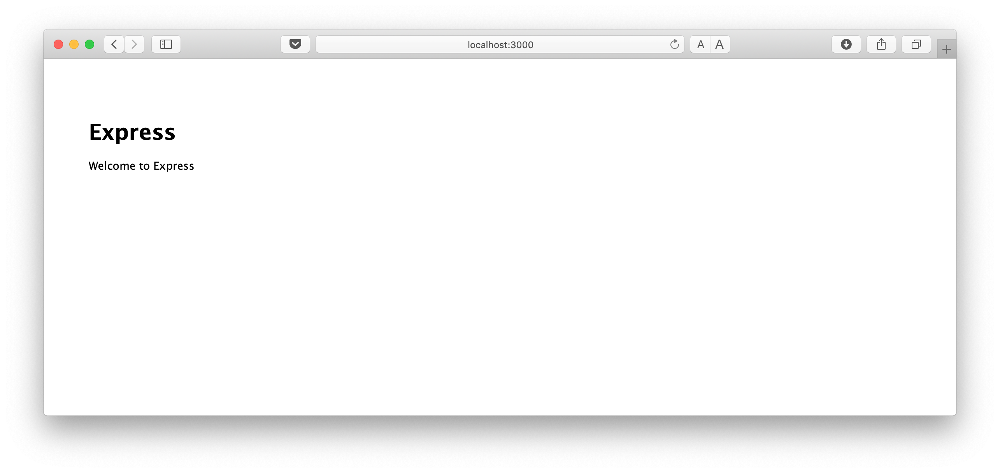

# Step 1: Bootstrap

Create a folder for the project 

```bash
mkdir passportjs-example 
cd passportjs-example 
```

Install express generator:

> npm install express-generator -g

Generate the project

> express -e .

Install all dependencies:

> npm i

Run the project

> npm start

Open http://localhost:3000, you should see this empty page



# Step 2: Bootstrap OpenID

Install `dotenv`

> npm install dotenv --save

Load `dotenv`, add the following lines on top of `app.js`:

```js
require('dotenv').config()
```

Create the `.env` file based on the `.env.example` one:

> cp .env.example .env

Get the OAuth-Client-Id and OAuth-Client-Secret from your SimpleLogin app and make sure to fill up the corresponding values in `.env`

Install `passport passport-openidconnect express-session`

> npm install passport@0.4.0 passport-openidconnect@0.0.2 express-session@1.15.6 --save

Add the following lines to `app.js` just below `var logger = require('morgan');` to import passport:

```js
var session = require('express-session');
var passport = require('passport');
var OidcStrategy = require('passport-openidconnect').Strategy;
```

At this step, `npm start` should still work and http://localhost:3000 is still this empty page.


# Step 3: Config passport.js

Just below `app.use(express.static(path.join(__dirname, 'public')));`, add the following line to init passport.js.

The first part is to config `session` for passport.js, please make sure to replace `very-secret` if you decide to deploy the code on production 😎. We also need to tell passport.js how to serialize/deserialize user from/to session.

The second part is to setup passport.js with OIDC endpoints and with the OAuth credential parsed from the `.env` file setup in previous step. 

```js
// passportjs use session to store user info
app.use(session({
  secret: 'very-secret',
  resave: false,
  saveUninitialized: true
}));

app.use(passport.initialize());
app.use(passport.session());

passport.serializeUser((user, next) => {
  next(null, user);
});

passport.deserializeUser((obj, next) => {
  next(null, obj);
});

// config different OIDC endpoints
passport.use('oidc', new OidcStrategy({
  issuer: 'https://app.simplelogin.io',
  authorizationURL: 'https://app.simplelogin.io/oauth2/authorize',
  tokenURL: 'https://app.simplelogin.io/oauth2/token',
  userInfoURL: 'https://app.simplelogin.io/oauth2/userinfo',
  clientID: process.env.CLIENT_ID, // OAuth config from env thanks to dotenv
  clientSecret: process.env.CLIENT_SECRET,
  callbackURL: 'http://localhost:3000/authorization-code/callback',
  scope: 'openid profile'
}, (issuer, sub, profile, accessToken, refreshToken, done) => {
  return done(null, profile);
}));

```


